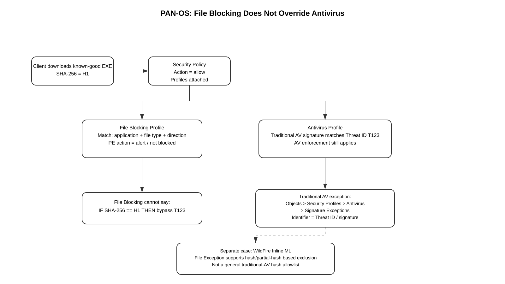

# PAN-OS File Blocking Cannot Create a Per-Hash Antivirus Exception

## Can File Blocking Be Used to Whitelist a Known-Good SHA-256?

> Scope: PAN-OS firewalls and Panorama. Cisco Secure Firewall/FTD is referenced only to explain the contrast with an exact SHA-256 Clean List.

## Table of Contents

1. [Short Answer](#1-short-answer)
2. [Why File Blocking Does Not Override Antivirus](#2-why-file-blocking-does-not-override-antivirus)
3. [What File Blocking Actually Matches](#3-what-file-blocking-actually-matches)
4. [What Antivirus Actually Matches](#4-what-antivirus-actually-matches)
5. [Packet and Content-Inspection Flow](#5-packet-and-content-inspection-flow)
6. [Can a Separate Security Policy Rule Help?](#6-can-a-separate-security-policy-rule-help)
7. [WildFire Inline ML Is the Exception](#7-wildfire-inline-ml-is-the-exception)
8. [Comparison with Cisco FTD](#8-comparison-with-cisco-ftd)
9. [Operational Workarounds](#9-operational-workarounds)
10. [Panorama Considerations](#10-panorama-considerations)
11. [Verification](#11-verification)
12. [Common Mistakes](#12-common-mistakes)
13. [Key Takeaways](#13-key-takeaways)
14. [References](#14-references)

---

## 1. Short Answer

**No. A PAN-OS File Blocking profile cannot be used to create an exact-file SHA-256 exception for a traditional Antivirus signature.**

File Blocking and Antivirus solve different problems:

- **File Blocking** controls whether selected **file types** are allowed, blocked, alerted, or require user continuation based primarily on application, file type, and transfer direction.
- **Antivirus** scans allowed content for malware and applies Antivirus/WildFire signature enforcement.
- A File Blocking rule that permits an executable does **not** suppress a traditional Antivirus Threat ID that detects that executable.
- Traditional PAN-OS Antivirus exceptions are configured as **Signature Exceptions using the Threat ID**.
- PAN-OS **WildFire Inline ML** has a separate **File Exceptions** feature based on hash/partial-hash information; that feature is not a general traditional-AV hash allowlist.

Therefore, this desired logic is **not available through File Blocking**:

```text
IF SHA256 == known_good_hash
    bypass traditional AV signature T123
ELSE
    enforce AV normally
```

---

## 2. Why File Blocking Does Not Override Antivirus

Palo Alto Networks treats File Blocking and Antivirus as separate **Security Profiles**.

A Security rule can permit a session and attach multiple inspection profiles, for example:

```text
Security Policy rule
  action: allow
  profiles:
    Antivirus: AV-Strict
    Anti-Spyware: AS-Strict
    Vulnerability Protection: VP-Strict
    URL Filtering: URL-Strict
    File Blocking: FB-Standard
    WildFire Analysis: WF-Forward
```

The fact that `FB-Standard` allows a file type does not mean `AV-Strict` stops inspecting it.

A useful mental model is:

```text
Security Policy decides: "May this session be allowed?"
                |
                v
File Blocking decides: "What should I do with this file type?"
                |
                v
Antivirus decides: "Does the transferred content match malware detection?"
```

The profiles are complementary controls, not hierarchical exception mechanisms for one another.



[Editable draw.io](../images/09-09-26-19-09_file_blocking_vs_antivirus_exception.drawio)

---

## 3. What File Blocking Actually Matches

Palo Alto Networks documents File Blocking profiles as controls for **specific file types** over specified applications and directions.

GUI path:

```text
Objects > Security Profiles > File Blocking
```

A File Blocking rule is built around fields such as:

```text
Name
Applications
File Types
Direction
Action
```

Documented actions include:

- `alert`
- `block`
- `continue` for applicable web traffic

File Blocking is therefore suitable for policies such as:

```text
Block PE downloads from general web browsing
Allow/alert PDF downloads
Prompt before selected file downloads
```

It is **not documented as accepting SHA-256 as match criteria**.

### Important consequence

If you configure File Blocking to allow PE files for a trusted application or user, you are allowing that **file type/traffic class** through the File Blocking control. You are not creating a cryptographic identity exception for one executable.

---

## 4. What Antivirus Actually Matches

For traditional Antivirus detections, PAN-OS can report a malware event with a Threat ID/Unique Threat ID associated with the signature.

Palo Alto Networks documents the exception workflow as:

```text
Objects
  > Security Profiles
    > Antivirus
      > <profile>
        > Signature Exceptions
```

Add the **Threat ID** for the antivirus signature that should be excluded from enforcement.

That means the exception is associated with the **signature**, not with one SHA-256.

Conceptually:

```text
Benign file B1 --------+
                       +--> AV signature T123
Malicious file M1 -----+
```

If `T123` is placed in Signature Exceptions, PAN-OS suppresses that antivirus signature in the applicable Antivirus profile. File Blocking cannot narrow the exception to only `B1` by hash.

---

## 5. Packet and Content-Inspection Flow

Consider a user downloading a known-good executable that unfortunately collides with AV signature `T123`.

```text
Client 10.10.10.25
    |
    | HTTPS download
    v
PAN-OS firewall
    |
    | Security Policy match: ALLOW
    v
Decryption, when applicable/configured
    |
    v
App-ID/content decoding
    |
    +--> File Blocking profile
    |      file-type = PE
    |      action = alert/allow behavior
    |
    +--> Antivirus profile
           content matches Threat ID T123
           action = reset/drop according to AV handling
```

The critical point is that File Blocking permitting the PE file does **not** mean:

```text
skip Antivirus
```

It means only that the File Blocking profile itself is not blocking that file type.

### Before and after fields

No NAT-specific transformation is relevant to this exception mechanism. File inspection operates on decoded application/content within the session. If SSL/TLS decryption is required to expose the file content, the relevant Decryption policy must permit inspection; otherwise visibility depends on the protocol/detection capability involved.

---

## 6. Can a Separate Security Policy Rule Help?

**It can reduce scope, but it still cannot match a file hash.**

You could create a narrowly scoped Security rule for the business application and attach a different Antivirus profile containing the Threat-ID exception.

Example design:

```text
Rule: Approved-Software-Download
Source: Approved-Admin-Users
Destination: Approved-Vendor-Site
Application: ssl, web-browsing, vendor-app as appropriate
Service: application-default
Action: allow
Profiles:
  Antivirus: AV-T123-Temporary-Exception
  File Blocking: FB-Approved-Software
```

Then use the normal strict profile everywhere else.

This is safer than placing `T123` into a globally used Antivirus profile because it reduces the exception's traffic scope.

However, the firewall is still matching the rule using normal Security Policy criteria—not the SHA-256 of the file. If the same malicious content matching `T123` traverses that narrowly scoped rule, the Threat-ID exception could also apply.

### What Security Policy cannot express

A standard PAN-OS Security rule cannot use this as a rule match key:

```text
SHA256 == abcdef...
```

So a separate Security rule is a **scope-reduction workaround**, not an exact-file hash whitelist.

---

## 7. WildFire Inline ML Is the Exception

Palo Alto Networks documents **File Exceptions** under WildFire Inline Machine Learning in the Antivirus profile.

Typical GUI location:

```text
Objects
  > Security Profiles
    > Antivirus
      > <profile>
        > WildFire Inline ML
          > File Exceptions
```

Current Palo Alto documentation describes the entry using a **partial hash**, filename, and description.

This capability is specifically documented for files that should be excluded from **WildFire Inline ML enforcement**.

It does **not** mean PAN-OS provides a general SHA-256 allowlist that overrides every conventional Antivirus signature.

Therefore always identify the detection source first:

```text
traditional Antivirus signature  -> Threat-ID Signature Exception
WildFire Inline ML detection     -> Inline ML File Exception may apply
```

---

## 8. Comparison with Cisco FTD

Cisco Secure Firewall/FTD has a materially different malware-file exception model.

Cisco FMC supports a **Clean List** containing a complete SHA-256. The exact file can then be treated as clean in the applicable malware/file-policy workflow.

That permits logic conceptually equivalent to:

```text
SHA256 H1 -> Clean List -> trusted file
SHA256 H2 -> normal evaluation
SHA256 H3 -> normal evaluation
```

PAN-OS File Blocking does not provide an equivalent exact-hash override for traditional Antivirus signatures.

| Capability | PAN-OS File Blocking | PAN-OS traditional Antivirus | PAN-OS WildFire Inline ML | Cisco FTD Clean List |
|---|---|---|---|---|
| Match file type | Yes | Detection engine dependent | Detection engine dependent | File-policy dependent |
| Match application | Yes | Decoder/application context | Model/context dependent | Policy dependent |
| Exact SHA-256 clean-list behavior for traditional AV | No | No | Not traditional AV; hash-based ML exception exists | Yes |
| Threat-ID exception | No | Yes | Separate mechanism | Different architecture |
| Can File Blocking override AV verdict? | **No** | N/A | N/A | N/A |

---

## 9. Operational Workarounds

For a confirmed benign file triggering a traditional Antivirus signature:

### Preferred path — correct the false positive

1. Confirm the file is genuinely trusted.
2. Record its SHA-256.
3. Record the PAN-OS Threat ID/UTID, threat name, rule, application, and content versions.
4. Ensure Antivirus and WildFire dynamic updates are current.
5. Use Threat Vault/WildFire information to investigate the detection.
6. Submit the false positive or engage Palo Alto Networks Support so the signature/verdict can be corrected.

### Temporary path — narrow the signature exception

If business impact requires a temporary exception:

1. Create a dedicated Antivirus profile.
2. Add only the required Threat ID under Signature Exceptions.
3. Apply the profile to the narrowest possible Security Policy rule.
4. Restrict that rule by users, source, destination, application, URL category/FQDN strategy where appropriate, and service.
5. Keep File Blocking, URL Filtering, Threat Prevention, and WildFire controls enabled where technically applicable.
6. Remove the Threat-ID exception after Palo Alto publishes a correction.

### Do not rely on File Blocking as the AV bypass

Changing PE files from `block` to `alert` or otherwise permitting the file type only changes File Blocking behavior. It does not create an Antivirus exception.

---

## 10. Panorama Considerations

For Panorama-managed firewalls, keep the workaround isolated in the appropriate **Device Group**.

Recommended workflow:

```text
1. Create/clone dedicated Antivirus profile in the appropriate Device Group.
2. Add the temporary Threat-ID Signature Exception.
3. Attach it only to the narrow Security Policy rule.
4. Commit to Panorama.
5. Push Device Group configuration to the required firewalls.
6. Verify the pushed rule/profile on the managed firewall.
7. Remove the exception after content correction.
8. Commit and Push again.
```

Remember:

- **Commit to Panorama** updates Panorama's configuration.
- **Push to Devices** sends the Device Group policy/profile change to managed firewalls.

Do not place a false-positive Threat-ID exception into a broadly inherited/shared Antivirus profile unless that scope is genuinely required.

---

## 11. Verification

### Check 1 — Identify the enforcement engine

**Where:** Firewall or Panorama

**Tool:**

```text
Monitor > Logs > Threat
```

**What it tests:** Whether the event is a traditional Antivirus/WildFire-signature event or WildFire Inline ML detection.

**Expected state:** Threat log contains the threat name/ID, action, application, rule, and relevant detection information.

**Failure indicator:** Attempting to select an exception mechanism before determining which engine produced the block.

**Next action:** Classify the event, then use Signature Exception or Inline ML File Exception as appropriate.

### Check 2 — Verify File Blocking behavior separately

**Where:**

```text
Objects > Security Profiles > File Blocking
```

and corresponding logs.

**What it tests:** Whether the file type itself is being blocked by File Blocking.

**Expected state:** The matched File Blocking rule/action is understood independently from the Antivirus action.

**Failure indicator:** Assuming a File Blocking `allow`/non-block action suppresses Antivirus.

**Next action:** Inspect the Antivirus profile referenced by the same Security rule.

### Check 3 — Verify the Antivirus profile

**Where:**

```text
Objects > Security Profiles > Antivirus
```

**What it tests:** Which decoder actions and Signature Exceptions apply.

**Expected state:** Only intentionally approved Threat IDs appear as exceptions.

**Failure indicator:** Broad shared profile contains temporary false-positive exceptions.

**Next action:** Move the exception to a narrower dedicated profile if feasible.

### Check 4 — Verify Panorama deployment

**Where:** Panorama and managed firewall

**What it tests:** That both Commit and Push completed successfully and the target firewall received the intended profile/rule.

**Expected state:** Managed firewall shows the expected policy/profile assignment.

**Failure indicator:** Change exists on Panorama but not on the target firewall.

**Next action:** Review push scope/status and correct Device Group targeting.

---

## 12. Common Mistakes

- Assuming **File Blocking = malware policy**. In PAN-OS, File Blocking primarily controls file types; Antivirus performs malware signature inspection.
- Allowing `.exe` in File Blocking and expecting a traditional AV false positive to disappear.
- Confusing **WildFire Inline ML File Exceptions** with traditional Antivirus Signature Exceptions.
- Adding a Threat-ID exception to the enterprise-wide AV profile when only one application/user population needs temporary relief.
- Treating a different filename as a different file; filename is not cryptographic identity.
- Creating an exception before confirming current Antivirus/WildFire content.
- Failing to remove the exception after Palo Alto corrects the signature.
- Assuming Cisco FMC Clean List behavior has a direct PAN-OS File Blocking equivalent.

---

## 13. Key Takeaways

1. **PAN-OS File Blocking cannot whitelist a specific SHA-256 against a traditional Antivirus detection.**
2. File Blocking matches file-policy characteristics such as **application, file type, direction, and action**, not a known-good SHA-256 exception.
3. Permitting a file in File Blocking does **not** override the Antivirus profile attached to the Security rule.
4. Traditional Antivirus false-positive exceptions remain **Threat-ID/signature scoped**.
5. **WildFire Inline ML File Exceptions** are hash/partial-hash based but apply to that separate detection path.
6. A dedicated Security rule/profile can **reduce the blast radius** of a Threat-ID exception, but it still cannot identify the one permitted file by SHA-256.
7. This remains a real functional difference from **Cisco FTD/FMC Clean Lists**, which can identify the exact trusted file by full SHA-256.

---

## 14. References

### Palo Alto Networks

- Security Profile: File Blocking  
  https://docs.paloaltonetworks.com/network-security/security-policy/administration/security-profiles/security-profile-file-blocking

- Security Profiles — explains that Security Profiles inspect traffic allowed by Security Policy and describes File Blocking separately from Antivirus  
  https://docs.paloaltonetworks.com/pan-os/11-1/pan-os-admin/policy/security-profiles

- Security Profile: Antivirus  
  https://docs.paloaltonetworks.com/network-security/security-policy/administration/security-profiles/security-profile-antivirus

- Configure an Antivirus Profile (PAN-OS & Panorama) — Signature Exceptions and WildFire Inline ML File Exceptions  
  https://docs.paloaltonetworks.com/network-security/security-policy/administration/security-profiles/security-profile-antivirus/configure-an-antivirus-profile-pm

- Create Threat Exceptions — Antivirus signature exceptions by Threat ID  
  https://docs.paloaltonetworks.com/advanced-threat-prevention/administration/configure-threat-prevention/create-threat-exceptions

- Enable Advanced WildFire Inline ML — File Exceptions for Inline ML false positives  
  https://docs.paloaltonetworks.com/advanced-wildfire/administration/configure-advanced-wildfire-analysis/enable-advanced-wildfire-inline-ml

- Triage and Resolution of False Positives in Palo Alto Networks Antivirus Profiles  
  https://knowledgebase.paloaltonetworks.com/articles/en_US/Knowledge/Triage-and-Resolution-of-False-Positives-in-Palo-Alto-Networks-Antivirus-Profiles

- What Is a Signature Collision?  
  https://knowledgebase.paloaltonetworks.com/articles/en_US/Knowledge/What-is-a-signature-collision

### Cisco comparison

- Cisco Secure Firewall Management Center Device Configuration Guide — file lists / malware and file policy  
  https://www.cisco.com/c/en/us/td/docs/security/secure-firewall/management-center/device-config/770/management-center-device-config-77/advanced-access-file.html

---

## Related Guide

- [PAN-OS vs Cisco Secure Firewall/FTD: File-Hash False-Positive Exceptions](09-09-26-19-09_pan_os_vs_cisco_ftd_file_hash_false_positive_exceptions.md)
