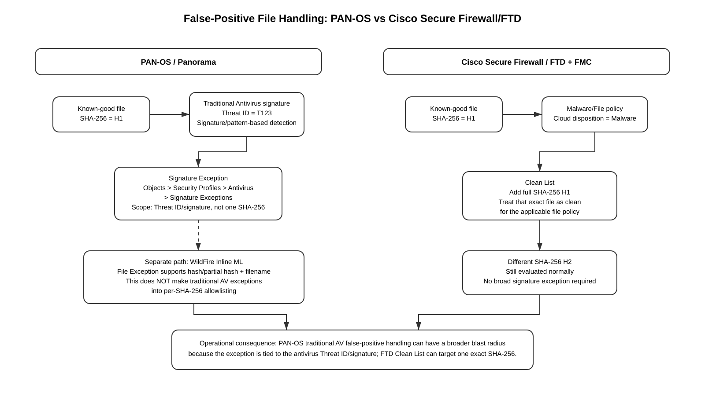

# PAN-OS vs Cisco Secure Firewall/FTD: File-Hash False-Positive Exceptions

## Why Cisco FTD Can Whitelist an Exact SHA-256 but PAN-OS Traditional Antivirus Cannot

> Scope: PAN-OS firewalls and Panorama, with Cisco Secure Firewall/FTD discussed only as a comparison point for file-malware exception behavior.

## Table of Contents

1. [Executive Summary](#1-executive-summary)
2. [The Core Difference](#2-the-core-difference)
3. [How PAN-OS Traditional Antivirus Exceptions Work](#3-how-pan-os-traditional-antivirus-exceptions-work)
4. [Why a PAN-OS Antivirus Exception Is Broader Than a Hash Allowlist](#4-why-a-pan-os-antivirus-exception-is-broader-than-a-hash-allowlist)
5. [WildFire Inline ML Is Different](#5-wildfire-inline-ml-is-different)
6. [How Cisco Secure Firewall/FTD Handles Exact SHA-256 Overrides](#6-how-cisco-secure-firewallftd-handles-exact-sha-256-overrides)
7. [Side-by-Side Comparison](#7-side-by-side-comparison)
8. [False Positive vs Signature Collision](#8-false-positive-vs-signature-collision)
9. [Recommended PAN-OS Operational Workflow](#9-recommended-pan-os-operational-workflow)
10. [Panorama Considerations](#10-panorama-considerations)
11. [Verification and Troubleshooting](#11-verification-and-troubleshooting)
12. [Common Mistakes](#12-common-mistakes)
13. [Design and Risk Implications](#13-design-and-risk-implications)
14. [Practical Example](#14-practical-example)
15. [Key Takeaways](#15-key-takeaways)
16. [References](#16-references)

---

## 1. Executive Summary

A common operational requirement is:

> "This exact file is known-good. Its SHA-256 is trusted. Allow this one file, but continue blocking every other file that matches the malware detection."

Cisco Secure Firewall/FTD supports this model directly for malware-file disposition overrides. An administrator can place the exact SHA-256 of a known-good file on a **Clean List**. Cisco documents that the system then treats that exact file as clean even if the cloud malware disposition would otherwise classify it as malware.

Traditional PAN-OS Antivirus handling is different. Palo Alto Networks documents **Signature Exceptions** for conventional Antivirus detections. These exceptions are created using the **Threat ID** associated with the antivirus signature. The exception therefore applies to the signature, not only to one SHA-256 file hash.

PAN-OS does have a file-hash exception capability, but Palo Alto documents that capability under **WildFire Inline ML File Exceptions**. It must not be confused with a general per-SHA-256 allowlist for traditional Antivirus signatures.

This distinction matters because a traditional Antivirus signature may match more than one file. If a benign file collides with a signature that also detects malware, disabling that Threat ID can suppress enforcement for every file that matches that signature in the scope where the Antivirus profile is applied.



[Editable draw.io](../images/09-09-26-19-09_pan_vs_ftd_file_hash_exception.drawio)

---

## 2. The Core Difference

### PAN-OS traditional Antivirus

**Source information:** Palo Alto Networks documents that Antivirus signature exceptions are configured using a **Threat ID**. For PAN-OS and Panorama, the administrator opens an Antivirus profile, selects **Signature Exceptions**, and adds the Threat ID to exclude that antivirus signature from enforcement.

That is signature-scoped behavior.

Conceptually:

```text
Known-good-file.exe
SHA-256 = H1
       |
       v
Traditional PAN-OS Antivirus engine
       |
       v
Threat ID T123 matched
       |
       v
Signature Exception for T123
       |
       +--> T123 no longer enforced in that Antivirus profile
```

The exception is not expressed as:

```text
IF SHA256 == H1
THEN allow
ELSE continue normal antivirus enforcement
```

### Cisco Secure Firewall/FTD

Cisco documents a different model in its Malware and File Policy framework. A file with a cloud disposition that the administrator believes is incorrect can have its **full SHA-256** added to a **Clean List**. Cisco states that the system treats that file as clean on subsequent detection.

Conceptually:

```text
SHA-256 H1 -> Clean List -> treat H1 as clean
SHA-256 H2 -> not on Clean List -> normal malware evaluation
SHA-256 H3 -> not on Clean List -> normal malware evaluation
```

This gives Cisco FTD a more granular exception mechanism for this specific use case.

---

## 3. How PAN-OS Traditional Antivirus Exceptions Work

Palo Alto Networks documents the PAN-OS/Panorama path as:

```text
Objects
  > Security Profiles
    > Antivirus
      > <profile>
        > Signature Exceptions
```

The administrator adds the **Threat ID** associated with the antivirus detection.

The Threat ID can be obtained from the firewall Threat log or related threat information. Palo Alto also documents using Threat IDs to inspect the associated threat in Threat Vault.

### Enforcement scope

The practical scope is the Antivirus profile containing the exception and the Security policy rules that reference that profile, directly or through a Security Profile Group.

### Important limitation

Palo Alto Networks explicitly distinguishes Antivirus signature exceptions from other threat exceptions. For antivirus signatures, PAN-OS allows the signature to be excluded from enforcement, but it does not provide the same per-signature action override flexibility documented for spyware and vulnerability signatures.

Most importantly for this article, the exception key is the **Threat ID**, not the exact SHA-256 of the benign file.

---

## 4. Why a PAN-OS Antivirus Exception Is Broader Than a Hash Allowlist

Traditional antivirus detection can be pattern or signature based. A signature may identify characteristics that can appear in multiple files.

Therefore:

```text
Malware-A.exe -----------+
                         |
Benign-Software.exe -----+--> both match Threat ID T123
                         |
Another-Sample.exe ------+
```

If the administrator creates an Antivirus Signature Exception for `T123`, PAN-OS is no longer enforcing that antivirus signature in the applicable profile.

This is materially different from exempting only:

```text
SHA-256 = 8af3...9d72
```

### Additional explanation

A SHA-256 allowlist has extremely narrow identity scope: changing even one byte normally changes the hash. A signature exception can have a wider detection scope because it suppresses the detection logic identified by the Threat ID.

### Reasonable inference

Because of that difference, a PAN-OS traditional Antivirus exception can carry a larger security blast radius than an exact-file hash allowlist. The actual exposure depends on what the signature detects, how broadly the profile is applied, and whether other security controls also detect the malicious content.

---

## 5. WildFire Inline ML Is Different

PAN-OS **does** support file exceptions using hash information under WildFire Inline Machine Learning.

Palo Alto Networks documents the following area:

```text
Objects
  > Security Profiles
    > Antivirus
      > <profile>
        > WildFire Inline ML
          > File Exceptions
```

Palo Alto documentation describes adding a **hash, filename, and description** for a file that should be excluded from WildFire Inline ML enforcement. Current Antivirus profile documentation describes these exceptions as being based on a **partial hash**.

This is a key distinction:

| Detection path | PAN-OS exception mechanism |
|---|---|
| Traditional Antivirus signature | Threat-ID / Signature Exception |
| WildFire Inline ML | File Exception using hash/partial hash information |

Do not assume that the WildFire Inline ML File Exception feature provides an exact SHA-256 whitelist for every traditional Antivirus signature event. Palo Alto documents these as separate exception mechanisms.

---

## 6. How Cisco Secure Firewall/FTD Handles Exact SHA-256 Overrides

Cisco Secure Firewall Management Center documents two special file-list concepts:

- **Clean List** — treat the listed SHA-256 as clean.
- **Custom Detection List** — treat the listed SHA-256 as malware.

For a false-positive use case, the Clean List is the relevant mechanism.

Cisco's current Secure Firewall Management Center documentation states that administrators can add an exact SHA-256 to a file list and that the system does not support partial values for this function.

Typical FMC path documented by Cisco:

```text
Objects
  > Object Management
    > File List
      > Clean List
        > Add by: Enter SHA Value
```

The administrator then supplies the complete SHA-256.

Cisco further documents that file policies can use the Clean List so that a file's disposition can be overridden without requiring the file to be reevaluated on each subsequent detection.

### Why this matters

The administrator can express:

```text
Allow only H1
```

without expressing:

```text
Disable malware signature T123 for every file it might match
```

That is the central behavioral difference from conventional PAN-OS Antivirus exceptions.

---

## 7. Side-by-Side Comparison

| Capability | PAN-OS traditional Antivirus | PAN-OS WildFire Inline ML | Cisco Secure Firewall/FTD malware file policy |
|---|---|---|---|
| Primary exception identifier | Threat ID / signature | File hash/partial hash + file metadata | Full SHA-256 |
| Exact-file false-positive handling | Not documented as a general traditional AV feature | Yes, for Inline ML exceptions | Yes, Clean List |
| Can preserve detection for other files matching the same AV signature? | Not necessarily; the signature itself is exempted | Yes for the specific Inline ML exception use case | Yes, other hashes continue normal evaluation |
| Central management | Panorama can distribute Antivirus profiles | Panorama-managed Antivirus profiles | FMC |
| False-positive vendor remediation path | WildFire verdict change / Support / updated content | Inline ML/WildFire correction path | Cloud disposition override plus Cisco malware ecosystem processes |
| Primary operational risk | Exception can be broader than one file | Narrower file-specific scope | Narrow file-specific scope |

---

## 8. False Positive vs Signature Collision

Palo Alto Networks uses the term **signature collision** for cases where a benign file is incorrectly identified because its byte patterns or structure match a signature generated for another malicious sample.

This can produce an especially important scenario:

```text
Malicious sample M1
SHA-256 = A
         |
         v
Antivirus signature T123 generated/matches

Benign sample B1
SHA-256 = B
         |
         +--> shares enough relevant signature characteristics
               to also match T123
```

Here the benign file and the malicious file have different SHA-256 values, yet the same antivirus signature can fire.

Palo Alto Networks recommends first ensuring Antivirus and WildFire content is current, then using the Threat ID and Threat Vault to investigate the hashes associated with the signature.

### Why a hash allowlist would be desirable

In a collision scenario, administrators often want:

```text
B is trusted -> allow B only
A is malicious -> continue blocking A
```

Cisco FTD's Clean List maps naturally to that requirement because the exception is based on B's SHA-256.

Traditional PAN-OS Antivirus instead gives the administrator a signature-level exception for T123. That may allow the business operation to proceed, but it is broader than allowing B alone.

---

## 9. Recommended PAN-OS Operational Workflow

For a suspected false-positive Antivirus detection, use the following sequence.

### Step 1 — Identify the detection type

Go to:

```text
Monitor > Logs > Threat
```

Determine whether the event is associated with conventional Antivirus/WildFire signature handling or WildFire Inline ML.

Palo Alto LIVEcommunity's PANCast material calls out three relevant threat-log categories:

```text
virus
wildfire-virus
ml-virus
```

The remediation path is not identical for each type.

### Step 2 — Record evidence

Capture at least:

```text
Threat ID
Threat name
Action
Application
Source / destination
File name, if available
SHA-256, if available
PAN-OS version
Antivirus content version
WildFire content/version state
Security rule
Antivirus profile
Timestamp
```

### Step 3 — Confirm content currency

Palo Alto's false-positive and signature-collision documentation advises confirming that Antivirus and WildFire dynamic content is current before creating a lasting exception.

### Step 4 — Investigate Threat Vault

Use the Threat ID from the Threat log to identify the associated signature and relevant file information.

Compare the known-good file's SHA-256 with hashes associated with the signature when that information is available.

### Step 5 — Decide which case applies

#### Case A: WildFire verdict itself is incorrect

Submit a **Report Incorrect Verdict** request through the WildFire workflow or engage Palo Alto Networks Support as appropriate.

#### Case B: Signature collision

If the known-good file has a different SHA-256 but matches the same AV Threat ID as a malicious sample, treat the condition as a signature-collision investigation.

Palo Alto's KB states that if the benign file is confirmed and the signature is producing a collision, an Antivirus exception can be used and Support can be engaged for signature reevaluation.

#### Case C: WildFire Inline ML false positive

Use the dedicated **File Exception** mechanism where appropriate instead of treating it as a conventional Antivirus Threat-ID exception.

### Step 6 — If an AV Signature Exception is unavoidable, constrain its scope

Create a dedicated Antivirus profile instead of weakening a broadly shared profile whenever policy architecture permits.

For example:

```text
Security Rule: Allow-Approved-Software-Download
  source: approved-admin-subnet
  destination: approved-software-site
  application: ssl/web-browsing as appropriate
  service: application-default
  Antivirus Profile: AV-Temporary-T123-Exception
```

Keep the exception out of the default enterprise-wide Antivirus profile when possible.

### Step 7 — Remove the exception after vendor correction

Once updated Palo Alto content resolves the false positive or collision, remove the temporary Threat-ID exception and recommit/push the profile.

---

## 10. Panorama Considerations

In Panorama-managed environments, the Antivirus profile can be part of a Device Group policy configuration.

Operationally distinguish:

```text
Commit to Panorama
```

from:

```text
Push to Devices
```

A local Panorama commit stores the candidate change in Panorama's running configuration. The managed firewalls do not receive the policy/profile change until the appropriate device-group push is performed.

### Recommended design

If only a narrow traffic class requires a temporary false-positive exception:

1. Clone or create a dedicated Antivirus profile.
2. Place the Threat-ID exception only in that profile.
3. Apply it to the narrowest Security rule that satisfies the business requirement.
4. Commit to Panorama.
5. Push the applicable Device Group configuration.
6. Verify the managed firewall received the profile and Security policy.
7. Remove the exception after the signature/verdict is corrected.

Avoid adding the Threat-ID exception to a shared enterprise-wide Antivirus profile unless the business requirement genuinely applies everywhere.

---

## 11. Verification and Troubleshooting

### Check 1 — Confirm the triggering Threat ID

**Where:** Firewall GUI or Panorama logs

**Tool:**

```text
Monitor > Logs > Threat
```

**What it tests:** Confirms exactly which antivirus threat signature generated the event.

**Expected state:** The event contains the relevant threat name, Threat ID, action, source/destination, application, and timestamp.

**Failure indicator:** The administrator is attempting to exempt a file without first proving which engine/signature generated the block.

**Next action:** Identify whether the event is `virus`, `wildfire-virus`, or `ml-virus` and choose the corresponding remediation path.

### Check 2 — Confirm the Security rule and Antivirus profile

**Where:** Firewall or Panorama policy configuration

**What it tests:** Determines which Antivirus profile is actually enforcing the event.

**Expected state:** The matching Security policy references the intended Security Profile Group or Antivirus profile.

**Failure indicator:** The exception was added to a profile that is not used by the matching rule.

**Next action:** Correct profile assignment or locate the actual rule/profile pair.

### Check 3 — Verify dynamic content is current

**Where:** Device dynamic updates

```text
Device > Dynamic Updates
```

**What it tests:** Ensures the firewall is not enforcing a signature already corrected in a newer content release.

**Expected state:** Current Antivirus and WildFire content appropriate for the deployed release/subscriptions.

**Failure indicator:** Old content remains installed or scheduled updates are failing.

**Next action:** Correct update connectivity/scheduling and retest before creating a broad exception.

### Check 4 — Validate the hash externally and in WildFire/Threat Vault

**Where:** Threat Vault / WildFire report / trusted malware-analysis source

**What it tests:** Helps distinguish incorrect verdict from signature collision.

**Expected state:** Evidence supports that the business file is benign and explains whether its SHA-256 is directly associated with the malicious verdict or merely collides with an AV signature.

**Failure indicator:** The file has significant independent malicious indicators.

**Next action:** Do not create a false-positive exception until the file has been validated.

### Check 5 — Verify Panorama push state

**Where:** Panorama

**What it tests:** Confirms the exception/profile/rule reached the target firewall.

**Expected state:** Commit succeeds and device push succeeds for the intended managed devices.

**Failure indicator:** Panorama is committed but the target firewall has not received the updated Device Group configuration.

**Next action:** Review push scope, commit-all/device-group status, and any validation errors.

---

## 12. Common Mistakes

### Mistake 1 — Assuming PAN-OS File Exceptions apply to all antivirus detections

They do not. Palo Alto documents File Exceptions specifically in the WildFire Inline ML portion of the Antivirus profile.

### Mistake 2 — Treating Threat-ID exception as equivalent to a SHA-256 whitelist

It is not equivalent. One references an antivirus signature; the other references one specific file identity.

### Mistake 3 — Applying the exception to the global/shared Antivirus profile

That unnecessarily increases scope. A dedicated temporary Antivirus profile and narrow Security rule can reduce exposure.

### Mistake 4 — Ignoring signature collision

The benign file may not be the original file that caused the AV signature to exist. Different hashes can match the same pattern-based signature.

### Mistake 5 — Skipping content updates

The problem may already be corrected by updated Antivirus/WildFire content.

### Mistake 6 — Leaving a temporary exception indefinitely

Document an owner and removal condition for every false-positive exception.

### Mistake 7 — Forgetting Panorama push

`Commit` and `Push` are separate operational steps in a Panorama-managed deployment.

---

## 13. Design and Risk Implications

### PAN-OS traditional Antivirus exception

Potential impact:

```text
Threat ID T123
   |
   +--> File A: known malware
   +--> File B: benign collision
   +--> File C: another file matching T123

Exception T123
   |
   +--> T123 enforcement suppressed in the profile scope
```

This is why the exception should be as temporary and narrowly applied as possible.

### Cisco FTD Clean List

Potential impact:

```text
File B SHA-256 = H-B
        |
        +--> Clean List

File A SHA-256 = H-A -> normal evaluation
File C SHA-256 = H-C -> normal evaluation
```

The exception scope is much closer to the administrator's intent when the requirement is "allow exactly this file."

### Defense-in-depth reminder

Even when a PAN-OS Antivirus Threat ID must temporarily be exempted, other PAN-OS controls may still provide protection depending on traffic and configuration, including:

- WildFire analysis
- WildFire Inline ML
- Vulnerability Protection
- Anti-Spyware
- URL Filtering
- DNS Security
- application controls
- Decryption, which can be required to expose encrypted file transfers for inspection

Do not assume these controls automatically compensate for an Antivirus exception; verify the actual packet/session inspection path.

---

## 14. Practical Example

Assume:

```text
File: vendor-update.exe
SHA-256: 1111...AAAA
PAN-OS Threat ID: 999999
PAN-OS action: reset-both
Business validation: vendor confirms file is legitimate
Threat Vault: Threat ID also corresponds to malicious samples with other hashes
```

### Desired policy

```text
Allow SHA-256 1111...AAAA
Continue blocking all other files that match Threat ID 999999
```

### Cisco FTD

This maps naturally to a Clean List entry:

```text
Clean List
  SHA-256 = 1111...AAAA
```

Other hashes continue through the malware disposition workflow.

### PAN-OS traditional Antivirus

The native conventional AV exception is:

```text
Signature Exception
  Threat ID = 999999
```

This does not express "only SHA-256 1111...AAAA."

A safer temporary PAN-OS workaround is therefore architectural scoping:

```text
Narrow Security rule
        |
        v
Dedicated Antivirus profile
        |
        v
Threat ID 999999 exception
```

Restrict that rule using the narrowest reasonable source, destination, application, URL/category context, schedule, and other policy conditions that are supported by the intended traffic flow.

Then pursue the permanent fix through Palo Alto's false-positive/verdict/signature-remediation process.

---

## 15. Key Takeaways

1. **Traditional PAN-OS Antivirus exceptions are Threat-ID/signature based.**
2. **They are not a general exact-SHA-256 allowlist for one benign file.**
3. **PAN-OS WildFire Inline ML has a separate file-exception capability using hash information.**
4. **Cisco Secure Firewall/FTD explicitly supports exact SHA-256 Clean List overrides for malware file dispositions.**
5. **A PAN-OS AV signature collision can involve a benign file and malicious files with different hashes matching the same Threat ID.**
6. **Before creating an exception, update content, inspect Threat logs, validate the hash, investigate Threat Vault/WildFire, and determine whether the issue is an incorrect verdict or signature collision.**
7. **If a traditional PAN-OS Antivirus exception is temporarily required, minimize its blast radius with a dedicated profile and narrowly scoped Security rule.**
8. **In Panorama, remember that Commit and Push are distinct operations.**

---

## 16. References

### Palo Alto Networks — Official Documentation

**Security Profile: Antivirus**  
https://docs.paloaltonetworks.com/network-security/security-policy/administration/security-profiles/security-profile-antivirus

**Configure an Antivirus Profile (PAN-OS & Panorama)**  
https://docs.paloaltonetworks.com/network-security/security-policy/administration/security-profiles/security-profile-antivirus/configure-an-antivirus-profile-pm

**Create Threat Exceptions**  
https://docs.paloaltonetworks.com/advanced-threat-prevention/administration/configure-threat-prevention/create-threat-exceptions

**Enable Advanced WildFire Inline ML**  
https://docs.paloaltonetworks.com/advanced-wildfire/administration/configure-advanced-wildfire-analysis/enable-advanced-wildfire-inline-ml

**WildFire Inline ML**  
https://docs.paloaltonetworks.com/wildfire/u-v/wildfire-whats-new/wildfire-features-in-panos-100/configure-wildfire-inline-ml

**Learn More About Threat Signatures**  
https://docs.paloaltonetworks.com/advanced-threat-prevention/administration/monitor-threat-prevention/learn-more-about-threat-signatures

### Palo Alto Networks — Knowledge Base

**Triage and Resolution of False Positives in Palo Alto Networks Antivirus Profiles**  
https://knowledgebase.paloaltonetworks.com/articles/en_US/Knowledge/Triage-and-Resolution-of-False-Positives-in-Palo-Alto-Networks-Antivirus-Profiles

**What is a signature collision?**  
https://knowledgebase.paloaltonetworks.com/articles/en_US/Knowledge/What-is-a-signature-collision

**What is an Antivirus Signature Collision in the case of a False Positive, and how can we deal with it?**  
https://knowledgebase.paloaltonetworks.com/KCSArticleDetail?id=kA10g000000ClWICA0

### Palo Alto Networks — LIVEcommunity

**PANCast Episode 20: Threat Logs - AV**  
https://live.paloaltonetworks.com/t5/pancast-episodes/pancast-episode-20-threat-logs-av/ta-p/546632

**False Positive AV block**  
https://live.paloaltonetworks.com/t5/advanced-threat-prevention/false-positive-av-block/td-p/216075

**False Positive Submission: 7zip installer**  
https://live.paloaltonetworks.com/t5/virustotal/false-positive-submission-7zip-installer/td-p/186266

### Cisco — Comparison References

**Cisco Secure Firewall Management Center Device Configuration Guide 7.7 — File Policies for Network Malware Protection**  
https://www.cisco.com/c/en/us/td/docs/security/secure-firewall/management-center/device-config/770/management-center-device-config-77/advanced-access-file.html

**Cisco Secure Firewall Management Center Device Configuration Guide 7.7 — Object Management / File Lists**  
https://www.cisco.com/c/en/us/td/docs/security/secure-firewall/management-center/device-config/770/management-center-device-config-77/objects-object-mgmt.html

**Cisco Secure Firewall Malware and File Policy Guidance**  
https://secure.cisco.com/secure-firewall/v7.0/docs/malware-and-file-policy

**Cisco FTD API — Custom Detection List**  
https://developer.cisco.com/docs/ftd-api-reference/latest/customdetectionlist/

---

## Source Classification Note

- Statements describing Palo Alto configuration paths, Threat-ID exceptions, WildFire Inline ML File Exceptions, signature-collision guidance, and false-positive remediation are based on Palo Alto Networks documentation, KB, and LIVEcommunity material listed above.
- Statements describing Cisco Clean Lists, full SHA-256 file-list entries, and disposition override behavior are based on Cisco documentation listed above.
- Security blast-radius discussion and recommendations to narrow the Security-rule/profile scope are additional architectural explanation and risk analysis derived from those documented behaviors.